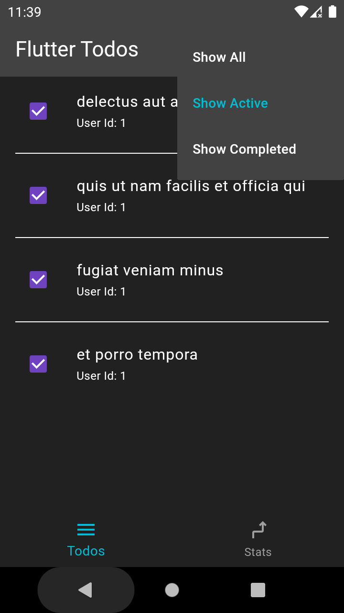
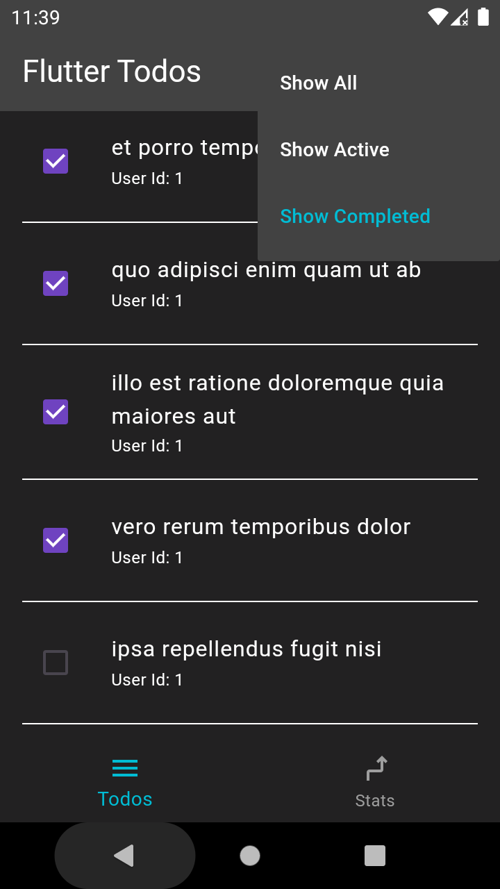

# todo_app

A new Flutter project.

## Getting Started

Todo List Creation: Users can create new tasks by providing a title and optional description. Each task is represented by its title.

Task Completion: Users can mark tasks as completed or incomplete by tapping on a checkbox  associated with each item. Completed tasks are visually differentiated from incomplete tasks.

Listing Tasks: The app provides a clean and organized interface for users to view their todo list. Tasks are displayed in a scrollable list, allowing users to easily browse through their tasks.

Filtering Options: Todo List Manager offers filtering options to help users focus on specific subsets of their todo list. Users can filter tasks based on their completion status, i.e., completed or incomplete.

 Deleting Tasks: Users can delete tasks as needed. Deleting removes tasks from the todo list.

Responsive Design: The app is built with a responsive design, ensuring a consistent user experience across different screen sizes and orientations, including smartphones and tablets.

User-Friendly Interface: Todo List Manager features an intuitive and user-friendly interface with smooth animations and transitions. Navigation within the app is straightforward, making it easy for users to perform tasks efficiently.

     

